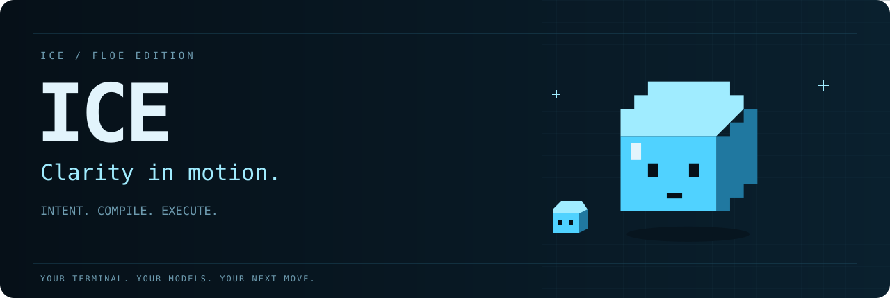
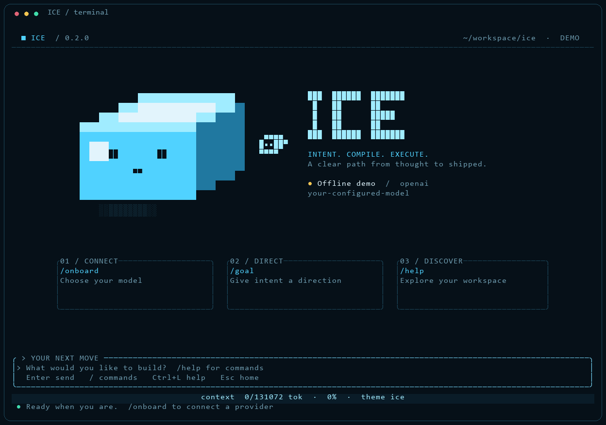

<p align="center">
  
</p>

<p align="center">
  <strong>An agentic coding tool that lives in your terminal.</strong><br>
  ICE reads your codebase, edits files, runs commands and works through multi-step tasks —<br>
  with any model provider, and your permission at every step that matters.
</p>

<p align="center">
  <a href="#install"></a>
  <a href="LICENSE"></a>
  <a href=".github/workflows/ci.yml"></a>
  
</p>

<p align="center">
  <a href="#install">Install</a> ·
  <a href="#quick-start">Quick start</a> ·
  <a href="#sign-in">Sign in</a> ·
  <a href="#what-ice-can-do">Features</a> ·
  <a href="#commands">Commands</a> ·
  <a href="#permissions">Permissions</a> ·
  <a href="#configuration">Configuration</a> ·
  <a href="docs/architecture.md">Architecture</a>
</p>

<p align="center"></p>

## Install

The installer **clones this repository and builds ICE from source** with `cargo` (it installs a minimal Rust toolchain through rustup if you don't have one). Re-running it, or `ice update`, pulls the latest commits and rebuilds.

**Linux · macOS**

```bash
curl -fsSL https://raw.githubusercontent.com/loayabdalslam/ICE/main/install.sh | bash
```

**Windows (PowerShell)**

```powershell
irm https://raw.githubusercontent.com/loayabdalslam/ICE/main/install.ps1 | iex
```

Requirements: `git`, a C linker (`build-essential` on Linux, Xcode command-line tools on macOS, the MSVC build tools on Windows). On Windows the installer falls back to the prebuilt, SHA-256-verified release binary if a source build isn't possible. Git for Windows provides the `bash.exe` ICE uses for shell commands.

<details>
<summary><strong>Installer options</strong></summary>

| Option (`install.sh` / `install.ps1`) | Meaning |
| --- | --- |
| `--ref REF` / `-Ref` | Branch, tag or commit to build (default `main`) |
| `--dir DIR` / `-SourceDir` | Where the source checkout lives (default `~/.local/share/ice/src`, `%LOCALAPPDATA%\ICE\src`) |
| `--bin-dir DIR` / `-InstallDir` | Where `ice` is installed (default `~/.local/bin`, `%LOCALAPPDATA%\Programs\ICE`) |
| `--binary` / `-Binary` | Install a prebuilt release binary (checksum-verified) instead of building |
| `--no-rustup` / `-NoRustup` | Don't install Rust automatically |
| `--no-path` / `-NoPath` | Don't edit your shell profile / user PATH |
| `-Uninstall` | Windows: remove ICE and the PATH entry |

```bash
curl -fsSL https://raw.githubusercontent.com/loayabdalslam/ICE/main/install.sh | bash -s -- --ref v0.5.0 --bin-dir ~/bin
```

Or build it yourself:

```bash
git clone https://github.com/loayabdalslam/ICE && cd ICE
cargo install --path .
```

</details>

## Quick start

```bash
cd your-project
ice
```

On first run ICE asks whether you trust the folder, then walks you through connecting a model provider. Then just describe what you want:

```text
> explain the structure of this project and find the entry points
> add input validation to the signup form and write tests for it
> the build is failing — fix it
```

Useful first steps: `/init` writes an `ICE.md` that teaches ICE your build, test and lint commands; `/help` lists everything.

## Sign in

Run `/onboard` (or `/login`) in ICE, or `ice login` in your shell. Pick a provider, then choose how to authenticate:

| Method | How it works |
| --- | --- |
| **Sign in with browser (OAuth 2.0 + PKCE)** | ICE opens your browser, listens on a local loopback callback, and exchanges the code with an S256 PKCE verifier (RFC 7636) and a CSRF `state` check. Tokens are stored in `~/.ice/credentials.json` (mode 0600) and refreshed automatically. |
| **Paste an API key** | Stored the same way, or read from the usual environment variable. |
| **CLI backend** | Delegate to an agent CLI you're already logged into (Codex / ChatGPT, Claude Code, opencode, Gemini CLI, Qwen Code). |

Browser sign-in is offered for every provider:

- **OpenRouter** works out of the box. Its public PKCE flow needs no app registration and returns an API key.
- **Google Gemini** uses Google OAuth. Create an OAuth client (type *Desktop app*) in Google Cloud Console, then run `ice config set oauth '{"gemini":{"clientId":"…","clientSecret":"…"}}'`.
- **Any other provider, or your own OpenAI-compatible gateway**, can sign in through an OAuth/OIDC app you register. Set `authorizeUrl`, `tokenUrl`, `clientId` (and optionally `clientSecret`, `scopes`) under `oauth.<provider>`, or through `ICE_OAUTH_<PROVIDER>_*` environment variables.

ICE never borrows another product's OAuth client ID. Providers such as OpenAI, Anthropic, Groq, xAI and Mistral don't publish third-party OAuth for their APIs, so for those use an API key, a CLI backend, or your organisation's gateway.

| Provider | Key variable | ID |
| --- | --- | --- |
| Anthropic | `ANTHROPIC_API_KEY` | `anthropic` |
| OpenAI | `OPENAI_API_KEY` | `openai` |
| Google Gemini | `GEMINI_API_KEY` / `GOOGLE_API_KEY` | `gemini` |
| xAI | `XAI_API_KEY` | `xai` |
| Groq | `GROQ_API_KEY` | `groq` |
| OpenRouter | `OPENROUTER_API_KEY` | `openrouter` |
| DeepSeek | `DEEPSEEK_API_KEY` | `deepseek` |
| Mistral | `MISTRAL_API_KEY` | `mistral` |
| Together AI | `TOGETHER_API_KEY` | `together` |
| Fireworks AI | `FIREWORKS_API_KEY` | `fireworks` |
| Ollama (local) | none needed | `ollama` |
| Any OpenAI-compatible endpoint | `ICE_API_KEY` + `ICE_BASE_URL` | `custom` |

The Anthropic API uses native Messages streaming with prompt caching and extended thinking. Every other provider uses the OpenAI-compatible Chat Completions API with native tool calling. Models without tool calling automatically switch to ICE's text tool protocol.

## What ICE can do

| | Capability | Details |
| --- | --- | --- |
| 🧊 | **Agentic loop** | Streams the model's answer and runs the tools it calls (independent reads in parallel), repeating until the task is done. Esc interrupts at any moment. |
| 🛠 | **Tools** | `Read`, `Write`, `Edit`, `MultiEdit`, `Glob`, `Grep`, `LS`, `Bash` (persistent working directory, timeouts, background shells via `BashOutput`/`KillShell`), `WebFetch`, `WebSearch`, `TodoWrite`, `Task`, `Skill`, and every MCP tool. Names, parameters and error messages match Claude Code's, so models use them fluently. |
| 🔐 | **Permissions** | Reads inside the project are free; edits, commands and fetches ask first, with a diff or command preview. Modes: default / accept edits / plan / bypass. Allow/deny rules such as `Bash(npm test:*)`. |
| ✍️ | **Safe edits** | A file must be read before it is edited, edits fail if the file changed on disk since, the old text must match uniquely, and CRLF line endings are preserved. Every change is shown as a diff. |
| 🧠 | **Memory** | `ICE.md` (also `CLAUDE.md` and `AGENTS.md`) from the project, its parents and `~/.ice/`, with `@path` imports. Type `# note` to save a memory. |
| 🤖 | **Sub-agents** | `Task` runs isolated agents (general-purpose, Explore, Plan) or your own from `.ice/agents/*.md`. Several can run in parallel. |
| 🔌 | **MCP** | stdio and streamable-HTTP servers from `.mcp.json`, `.ice/mcp.json` and `~/.ice/mcp.json`. Manage them with `ice mcp add/list/remove`. |
| 🪝 | **Hooks** | `PreToolUse`, `PostToolUse`, `UserPromptSubmit`, `Stop` and `SessionStart` shell hooks. Exit code 2 blocks the action and tells the model why. |
| 💾 | **Sessions** | Every conversation is saved under `~/.ice/projects/`. Pick up with `ice -c`, `ice -r`, or `/resume`. `/rewind` (or Esc Esc) jumps back to an earlier message. |
| 📦 | **Context** | Real token usage and cost per turn, `/context` breakdown, and automatic compaction before the window fills (`/compact` on demand). |
| 🧾 | **Scripting** | `ice -p` prints the result, with `--output-format json` or `stream-json` and piped stdin. |
| 🎯 | **Goals** | `/goal <outcome>` keeps an objective in every turn until you clear it. |

## Commands

### Shell

| Command | Purpose |
| --- | --- |
| `ice` | Interactive session in the current directory |
| `ice "prompt"` | Start with a first message |
| `ice -p "prompt"` | Print the answer and exit (`--output-format text\|json\|stream-json`) |
| `cat log \| ice -p "why did this fail?"` | Pipe content in |
| `ice -c` / `ice -r [ID]` | Continue the latest conversation / resume one |
| `ice --model sonnet` | Model for this session (aliases: `sonnet`, `opus`, `haiku`) |
| `ice --permission-mode plan\|acceptEdits` | Start in a permission mode |
| `ice --allowedTools "Bash(git log:*)" Edit` | Pre-approve tools (`--disallowedTools` to block) |
| `ice --max-turns 5 --append-system-prompt "…"` | Scripting controls |
| `ice login [provider]` / `ice logout` | Browser sign-in (PKCE) or API key / remove credentials |
| `ice mcp add NAME -- CMD ARGS…` · `ice mcp list` · `ice mcp remove NAME` | Manage MCP servers (`--transport http`, `--scope local\|project\|user`) |
| `ice config list\|get\|set\|path` | Settings |
| `ice init` | Scaffold `.ice/` (shared settings, example command and agent) |
| `ice update [--check]` | Pull and rebuild (source install) or download (binary install) |
| `ice doctor` | Check the installation, providers, settings and MCP |
| `ice completions bash\|zsh\|fish\|powershell` | Shell completions |

### Inside ICE

| Command | Purpose |
| --- | --- |
| `/onboard`, `/login`, `/logout` | Connect a provider (browser OAuth or key) |
| `/model`, `/providers` | Switch model / list providers |
| `/goal <text>` | Give intent a direction (`/goal clear`) |
| `/init` | Generate `ICE.md` for this codebase |
| `/memory` | Edit memory files in `$EDITOR` |
| `/clear`, `/compact [focus]` | Fresh context / summarise and continue |
| `/resume`, `/rewind` | Reopen a conversation / go back to an earlier message |
| `/cost`, `/context`, `/status` | Usage, context breakdown, setup |
| `/permissions [allow\|deny\|remove RULE]` | Show and edit rules |
| `/mcp`, `/agents`, `/skills`, `/hooks`, `/bashes`, `/todos` | Integrations and state |
| `/review [PR]` | Review your changes or a pull request |
| `/config`, `/theme` | Settings panel / colour theme |
| `/export [file]`, `/doctor`, `/help`, `/exit` | Utilities |
| `/your-command` | Custom commands from `.ice/commands/*.md` (`$ARGUMENTS`, `$1`…) |

### Keys

`Enter` send · `\`+`Enter`, `Alt+Enter` or `Ctrl+J` newline · `Esc` interrupt · `Esc Esc` rewind · `Shift+Tab` cycle permission modes · `↑`/`↓` history · `Tab` complete `/commands` and `@files` · `Ctrl+R` full transcript · `Ctrl+T` todos · `Ctrl+L` shortcut help · `Ctrl+C` twice to exit.

Prefixes: `!cmd` runs a shell command directly (its output joins the conversation), `#note` saves a memory, `@path` attaches a file.

## Permissions

| Mode | Behaviour |
| --- | --- |
| **default** | Ask before edits, most shell commands, web fetches and MCP tools. Read-only commands (`git status`, `ls`, `grep`…) run freely. |
| **acceptEdits** | File edits inside the project (plus `mkdir`/`touch`/`cp`/`mv`) are auto-approved. |
| **plan** | Read-only research. ICE presents a plan and waits for your approval before changing anything. |
| **bypassPermissions** | Never ask. Only for sandboxes (`--dangerously-skip-permissions`). |

Rules live in `.ice/settings.json` (shared), `.ice/settings.local.json` (personal, git-ignored) and `~/.ice/settings.json`:

```json
{
  "permissions": {
    "allow": ["Bash(npm run test:*)", "Bash(git diff:*)", "WebFetch(domain:docs.rs)", "mcp__github"],
    "deny":  ["Read(./.env)", "Bash(curl:*)"],
    "defaultMode": "acceptEdits"
  }
}
```

A compound command is allowed only if every part is allowed, and it is denied if any part is denied. Paths resolve through symlinks, so a link pointing outside the project doesn't count as inside it. Choosing "don't ask again" in a prompt saves the matching rule for you.

## Configuration

| File | Purpose |
| --- | --- |
| `~/.ice/settings.json`, `.ice/settings.json`, `.ice/settings.local.json` | `permissions`, `hooks`, `env`, `model`, `theme`, `oauth`, `autoCompactEnabled`, `autoUpdates`, `cleanupPeriodDays` |
| `~/.ice/credentials.json` | Saved API keys and OAuth tokens (0600) |
| `~/.ice/config.json` | Active provider/model and trusted folders |
| `ICE.md`, `ICE.local.md`, `~/.ice/ICE.md` | Instructions for ICE (also reads `CLAUDE.md`, `AGENTS.md`) |
| `.mcp.json`, `.ice/mcp.json`, `~/.ice/mcp.json` | MCP servers |
| `.ice/commands/`, `.ice/agents/`, `.ice/skills/` | Custom commands, sub-agents and skills (`.claude/…` layouts work too) |

Useful environment variables: `ICE_PROVIDER`, `ICE_MODEL`, `ICE_BASE_URL`, `ICE_API_KEY`, `ICE_MAX_OUTPUT_TOKENS`, `ICE_CONFIG_DIR`, `ICE_TEXT_TOOLS`, `ICE_NO_AUTO_UPDATE`, `HTTPS_PROXY`/`NO_PROXY`, `NO_COLOR`.

<details>
<summary><strong>Hooks example</strong></summary>

```json
{
  "hooks": {
    "PreToolUse": [{ "matcher": "Bash", "hooks": [{ "type": "command", "command": "./scripts/check-command.sh" }] }],
    "PostToolUse": [{ "matcher": "Edit|Write", "hooks": [{ "type": "command", "command": "cargo fmt" }] }]
  }
}
```

The hook receives the event as JSON on stdin. Exit code 2 blocks the action and its stderr goes back to the model.
</details>

## How it works

```text
you ─▶ REPL (inline TUI) ─▶ engine worker ─▶ model adapter (Anthropic | OpenAI-compatible | text protocol)
                                  │                      ▲ SSE stream (text · thinking · tool_use)
                                  ▼                      │
                     permissions + hooks ─▶ tools / MCP / sub-agents ─▶ tool_result ─┘
                                  │
                                  └─▶ transcript (~/.ice/projects/…/<session>.jsonl)
```

See [docs/architecture.md](docs/architecture.md) for the module map and the life of one turn, and [ROADMAP.md](ROADMAP.md) for what's next.

## Development

```bash
cargo build                  # debug build
cargo test                   # unit tests + end-to-end tests against a mock LLM server
cargo clippy --all-targets -- -D warnings
cargo fmt --all
```

CI runs formatting, clippy, the tests on Linux, macOS and Windows, a release build, and an installer smoke test that clones and builds the commit. Tagging `vX.Y.Z` runs the release workflow, which publishes checksummed binaries for five targets.

## Troubleshooting

| Symptom | Fix |
| --- | --- |
| `ice` not found after install | Open a new terminal, or add the install directory to `PATH`. |
| "No model is configured" | Run `/onboard` (or `ice login`), or export a provider key. |
| Build fails during install | Install a C toolchain (see Requirements), or use `--binary`. |
| Behind a proxy | Set `HTTPS_PROXY` (and `NO_PROXY` for local servers). ICE honours both. |
| Odd colours or glyphs | Use a Unicode terminal. ICE switches to 256 colours automatically and respects `NO_COLOR`. |
| Anything else | Run `ice doctor`, then [open an issue](https://github.com/loayabdalslam/ICE/issues/new) (remove keys from logs). |

## License

[Apache-2.0](LICENSE). The UI icons are from [Bootstrap Icons](https://github.com/twbs/icons) (MIT). FLOE and the ICE identity assets belong to this project.

<p align="center"><br><strong>Intent. Compile. Execute.</strong><br><sub>Built for the terminal. Made for your next idea.</sub></p>
